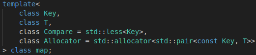
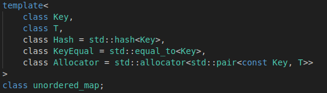
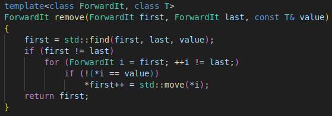
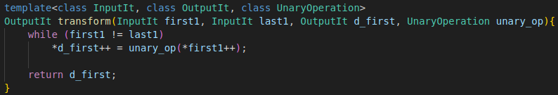
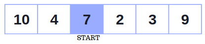
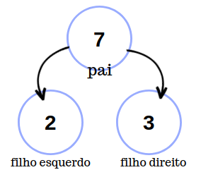
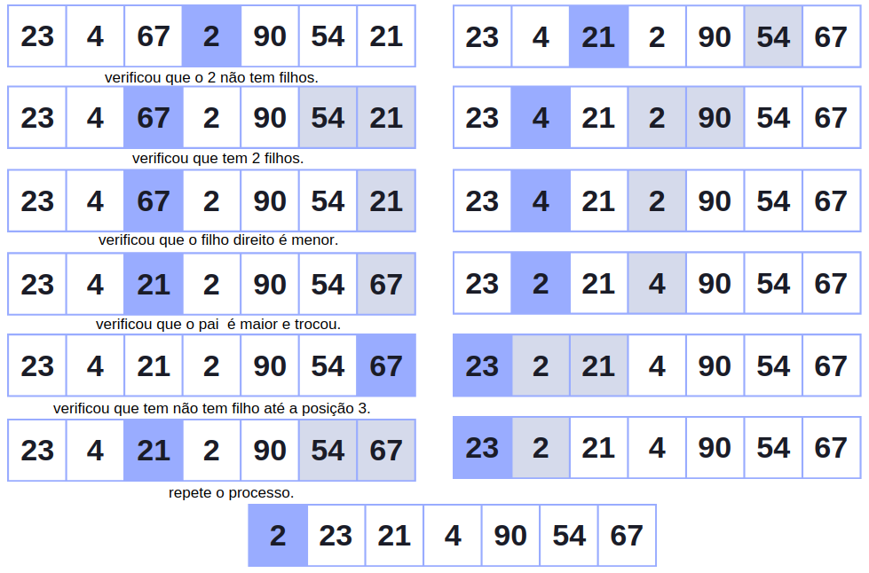
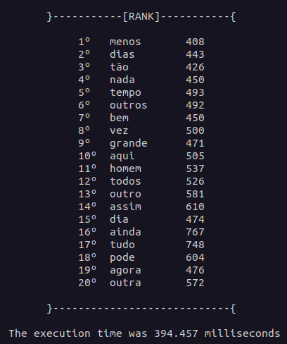

# AEDS: Top K elementos

A pedido do professor de Algoritmos e Estruturas de Dados do CEFET - Divinópolis, foi desenvolvido um algoritmo em C++, que executa X arquivos do tipo .txt e lista as K palavras com maior ocorrência.

# Sumário

- [Objetivo](#objetivo)
- [Especificações Gerais](#especificações-gerais)
- [Arquivos](#pastas-e-arquivos)
- [Lógica](#lógica)
- [Saída](#saída)
- [Conclusão](#conclusão)
- [Referências](#referências)

# Objetivo

Esse algoritmo tem como objetivo percorrer vários arquivos .txt, ler cada linha e contabilizar a frequência de cada palavra em todos os arquivos, analisando se elas são diferentes de Stop Words, caso forem não farão parte do cálculo de ocorrência. Ademais, o código irá através do heapify listar as 20 palavras que mais aparece em todos os arquivos disponibilizados.

# Especificações Gerais

<ul  align="justify">
 <li>(1): Ler diferentes arquivos do tipo .txt criando uma única tabela de dispersão (hash) para contabilizar a ocorrência de cada palavra diferente de stop word.</li>
 <li>(2): Criar um heap e colocar os K primeiro elementos da hash nela.</li>
 <li>(3): Para todos elementos da hash restante comparar com a palavra de menor ocorrência do heap, caso o elemento do heap for maior é necessário remover do heap a de menor valor e adicionar a atual que está sendo comparada. Caso contrário apenas continuar a leitura da hash. </li>
 <li>(4): Ao fim do algoritmo disponibilizar a heap com os K elementos que mais apareceram.</li>
</ul>

- TEM QUE DEFINIR OS VALORES K (quantos elementos para o rank) E ALL (quantos arquivos serão lidos) DENTRO DO functions.cpp

## Arquivo de Entrada

 <ul>
    <li>1 - Todos os arquivos devem ter o mesmo formato (.txt);</li>
    <li>2 - O primeiro arquivo de entrada teve ser nomeado com o nome 'input0.txt', em caso de mais de uma arquivo adicionar números em ordem crescente começando do 1 apos a palavra 'input', exempo : input1.txt, input2.txt ;</li>
    <li>3 - O arquivo de stop word deve ser único, e nomeado como o exemplo: stopWord.txt;</li>
    <li>4 - o arquivo de stop word deve ter a seguinte formatação: uma palavra por linha e não pode conter expressões;</li>
 </ul>

# Pastas e Arquivos

### Pasta input

Todos os arquivos de entrada devem ser colocados nesta pasta, de acordo com as especificações encontradas acima. 

### Pasta src

* `main.cpp`: O arquivo é responsável por criar um mapa não ordenado (unordered_map) para receber todas as stop words que serão recebidas através de uma função, criar um map para receber todas as palavras diferentes de stop word através de uma função e chamar outra função que será responsável por retornar os K elementos mais comuns;
* `functions.cpp`: arquivo que se encontram as todas as funções do algortimo;
* `library.hpp`: arquivo que contém os cabeçalhos das bibliotecas que serão usadas em todo o algoritmo;
* `Makefile`: arquivo de execução do algoritmo

# Lógica 

O algoritmo começa criando uma Hash do tipo [map](#map) que vai conter todas as palavras de todos os arquivos através da função `returnHash(allStopWords);`que recebe como parâmetro uma outra Hash do tipo [unordered_map](#unordered_map) que contém todas as stop words lidas do arquivo da pasta input através da função `returnAllStopWord();`. O tipo map foi escolhido por ser mais eficiente quando se trata de grandes quantidades de dados e quando é necessário acessar as palavras em sequência apresenta melhor utilidade. Já o unordered_map, por apresentar mais praticidade em encontrar valores de forma não sequencial (aleatório) que é o caso de quando precisar verificar uma stop word. Ao final chama a função `returnHeap(wordHash);` que recebe toda a hash de palavras e retorna as K que mais apareceram através do heapify.

* ` returnAllStopWord();` : essa função abre o arquivo em modo de leitura, cria uma hash temporariamente, e vai salvando todas as stopwords presente no arquivo (stopWord.txt) ao final retorna essa hash.
*  `returnHash(unordered_map <string,int> allStopWords);` : essa função vai percorrer todos os arquivos por linha, em cada linha é chamada a função `cleanline(string line);` que remove todos caracteres desnecessários (,;.!?.\|(){}[]) através da função [erase](#erase) da biblioteca string, depois é feito uma tokenização através do [istringstream](#istringstream) e dentro de um loop chama a função `void updateWord(word,wordHash,allStopWords);` onde word é o token, no final retorna uma hash com todas as palavras de todos os arquivos.
* `void updateWord(word,wordHash,allStopWords);` :  essa função pega a palavra que foi passada como parâmetro e passa ela toda para minúsculo através da função `toLowercase(string word)`, logo em seguida ele procura se essa palavra é uma stopword, caso sim dá um return, caso contrário ela procura a palavra na hash para checar se ela já foi adicionada e aumentar a ocorrência ou apenas adicionar sua primeira aparição.
* `toLowercase(string word);` :  faz uso da função [transform](#transform) da biblioteca algorithm para transformar a palavra em minúscula e, em seguida, retorna a palavra já tratada.
* `returnHeap(wordHash);` : dentor de um for que percorrer toda a hash de palavras, essa função pega os primeiros K elemntos da hash e faz um heapify após pegar todos eles atravas da função `void makeHeap(heapWord)`, onde heapWord é um vector do tipo pair do tipo string e int. Quando passar dos K elementos sera executado a função `void lookInTheHeap(auxHeapWord,heapWord);` todas vez que ler uma nova palavra da hash.
* `makeHeap(heapWord)` : essa função apenas aplica o conceito de [heapify](#heapify) deixando sempre na primeira posição a palavra de menor ocorrência.
* `void lookInTheHeap(auxHeapWord,heapWord);` : apenas faz a verificação se a palavra atual da hash é maior que a primeira posição do heap, caso sim faz a substituição e chama a função makeheap.

### Map

É uma classe que armazena informações em pares, onde uma é a chave e outra é o valor, cada elemento tem que possuir sua própria chave, caso contrário vai ter colisões. Vale ressaltar que ele fornece iteradores bidirecionais, isso permite o acesso dos elementos do map em qualquer ordem. Segundo o site da microsoft  ss containers associativos (map) são otimizados para as operações de pesquisa, inserção e remoção (ambas tem complexidade logarítmica). Os mapas são geralmente implementados como árvores Red–black tree. As árvores Red–black tree são uma estrutura de dados de alta performance que garante a ordenação dos elementos e a exclusividade das chaves - segundo cppreference. Com isso garante que as palavras vão esta ordenadas, (no caso deste algoritmo não faz diferença) o motivo de escolha foi por std::map apresentar ser melhor que o unordered_map quando se vai acessar o valores de forma sequencial (que é caso quando vai se fazer o heapify). Veja abaixo a declaração do tipo map:

  

Onde key é o tipo da chave, T o tipo do dado, o compare é uma função que compara as chaves em ordem crescente. Isso significa que a função de comparação `less<Key>` retorna true se a primeira chave for menor que a segunda chave, false se a primeira chave for maior ou igual à segunda chave, e throw se as chaves não forem comparáveis.Veja abaixo os custos computacionais de cada modalidade:

- Inserção: O(log n)
- Pesquisa: O(log n)
- Remoção: O(log n)
- Iteração: O(n)

### Unordered_map

É uma classe que faz o uso da tabela de espalhamento (Hash), mas diferente da map ela não faz ordenação do valores das chaves. São organizados em buckets. O bucket em que um elemento é colocado depende inteiramente do hash de sua chave. As chaves com o mesmo código hash aparecem no mesmo bucket. Isso permite o acesso rápido a elementos individuais, uma vez que, uma vez calculado o hash, ele se refere ao bucket exato em que o elemento está inserido.

  

Onde key é o tipo da chave, T o tipo do dado, hash é a função que é usada para calcular o hash das chaves. A função de hash é usada para converter uma chave em um valor inteiro, chamado código hash. O código hash é então usado para armazenar a chave em uma tabela hash. As tabelas hash são uma estrutura de dados que permitem o acesso rápido a elementos, pois os elementos são armazenados em buckets com base em seus códigos hash. KeyEqual é a função de igualdade de chaves que é usada para comparar as chaves e o Allocato para alocar memória pro mapa.

Informação extra: você pode declarar sua própria função hash da seguinte maneira: `unordered_map<int, string, my_hash> my_map;` onde my_hash é a sua função. Veja abaixo o custo computacional de algumas modolidades:

- Inserção: O(1)
- Pesquisa: O(1)
- Remoção: O(1)
- Iteração: O(n)

### Erase

Ela é uma função da biblioteca string, que remove caracteres de uma determinada string passando todos os carácter sucessor ao removido para esquerda para ocupar os lugares em branco. Ao fim do tamanho da string é reduzido de acordo com a quantidade de posições apagadas. Explicação:

1. A função primeiro verifica se o argumento pos (posição do primeiro caracter) é válido. Se não for, a função lança uma exceção out_of_range.
2. A função então obtém o iterador para o primeiro caractere a ser removido.
3. A função itera sobre todos os caracteres seguintes ao primeiro caractere a ser removido e move cada um para a esquerda para preencher o espaço vazio.
4. A função então diminui o comprimento da string pelo número de caracteres removidos.
5. A função retorna um iterador que se refere ao caractere que agora ocupa a posição do primeiro caractere removido.

No código foi usada essa função, com outra dentro (remove), onde essa é um algoritmo que recebe iteradores no início e no final do contêiner e o valor a ser removido (`remove(sring.begin(), string.end(), char)`). O motivo de usar as duas funções juntas é que a função erase remove ou um intervalo de uma string ou uma posição única, já usando remove ela vai remover todas as ocorrências daquele carácter e apagar os intervalos que ela ocorre. Veja abaixo uma implementação disso de acordo o cpp reference:

  

1. first, last    -  o intervalo de elementos a processar
2. value    -  o valor dos elementos a remover
3. policy   -  a política de execução a ser usada. Consulte a política de execução para obter detalhes.
4. p  -  um predicado unário que retorna ​true se o elemento deve ser removido.

### Istringstream

A classe std::basic_istringstream usa uma implementação de dispositivo de string bruto de std::basic_stringbuf para armazenar a string que será usada como fonte de dados. A classe então usa os métodos de std::basic_istream para ler dados da string. Os métodos de std::basic_istream são usados para ler dados de uma stream (stream é uma sequência de dados que são processados em sequência) de caracteres. Os métodos disponíveis incluem read(), gcount() e gpeek(). O método read() lê um número especificado de caracteres da stream e os retorna em um buffer. O método gcount() retorna o número de caracteres que foram lidos da stream com o último chamado de read(). O método gpeek() retorna o próximo caractere que será lido da stream, mas não o remove da stream. A classe std::basic_istringstream usa os métodos de std::basic_istream para ler dados da string que foi definida com o método str(). Os dados lidos da string são então armazenados na classe std::basic_istringstream e podem ser acessados usando os métodos de std::basic_istream.
No código o operator `>>` dentro do loop do while serve como delimitador (no caso o espaço) para pegar apenas o valores que tem entre os caracteres vazios.

### Transform

Essa função faz parte da biblioteca algorithm, ela basicamente analisa de início ao fim (um intervalo) algum tipo de entrada e aplica uma função em cada pedaço desse intervalo. Segundo a biblioteca cpp reference o transform inicializa o iterador (first 1)para inicio do primeiro intervalo (que vai ser percorrido), depois ele inicializa outro iterador (d_first) para o início do intervalo de destino. Enquanto o iterador first1 não foi igual ao last1, a função passada como parâmetro será executada no local apontado. O resultado vai para posição apontado pelo iterador d_first, em seguida d_first e first1 são incrementados. Ao final da execução returna o d_first. Segue abaixo um exemplo de implementação:

  

### Heapify

Ele é um algoritmo usado no heapsort, onde usa o conceito de pai e filho. Ele começa da metade do vetor e vai decrescendo conforme as interações. A posição i é chamada de pai, as posições (i\*2+1) de filho esquerdo e (i*2+2) de filho direito. Enquanto na interação o filho esquerdo for menor ou igual ao do tamanho final do vetor (K), ele vai analisar se o filho à esquerda é maior que o da direita. Caso sim, pega-se a posição do filho direito e compara com o pai. Caso o pai seja maior, troca-se os dois de posição, e agora passa analisar a partir da posição do filho atual até não ter mais filhos para comparar. Esse processo vai acontecer até o for chegar à posição zero do vetor. Ao final da execução, os valores não estarão ordenados, mas na primeira posição do vetor sempre vai estar o dado de menor valor (ocorrências). O custo do heapify é de log(n), mas no caso desse algoritmo seria log(K). 

- Vetor de 6 posições, como é par não começa no meio certinho.

   

- Pai e filhos.

   

- Exemplo de uma verificação completa:

   

# Saída

   

# Conclusão 

Conclui-se que as escolhas de estruturas possibilitaram uma boa execução do código. Durante a formulação desse trabalho, foi usado o Regix, que fez o tempo de execução do algoritmo 10 vezes mais lento. Quando trocado pelo transform, o tempo foi reduzido significativamente. O conceito de hash se torna muito funcional nesse algoritmo, devido ao fato de que se uma colisão ocorrer, é devido ao fato de aquela chave já existir. Isso pode ser usado como um contabilizador para as palavras.O uso do heapify possibilitou que trocas desnecessárias durante a execução do código não acontecesse. Isso ocorre porque ele coloca o menor valor no topo e apenas ele é comparado com as ocorrências do hash, em vez de verificar todos os K elementos.Como saída, vimos que o rank não está em ordem crescente, mas a palavra que apareceu menos vezes está no topo (posição 0).

# Compilação e Execução

Esse pequeno exemplo possui um arquivo Makefile que realiza todo o procedimento de compilação e execução.  Para tanto, temos as seguintes diretrizes de execução:

| Comando                |  Função                                                                                           |                    
| -----------------------| ------------------------------------------------------------------------------------------------- |
|  `make clean`          | Apaga a última compilação realizada contida na pasta build                                        |
|  `make`                | Executa a compilação do programa utilizando o gcc, e o resultado vai para a pasta build           |
|  `make run`            | Executa o programa da pasta build após a realização da compilação           

# Referências

* https://cplusplus.com/reference/string/string/erase/;
* https://en.cppreference.com/w/cpp/algorithm/transform;
* https://en.cppreference.com/w/cpp/algorithm/remove;

# Contatos
<a>
✉️ <i>lucaslimadeoliveira80@gmail.com</i> 
</a>
